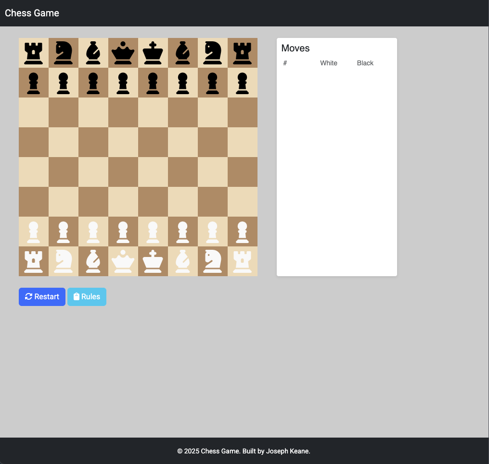

# Chess Game

This is a chess game where you can play against another person. It allows you to switch themes. It incorporates the rules and movement of the game of chess into the site so you cannot make any illegal moves. If you wish to learn how to play the game I have linked the tutorial on lichess for the game. I hope to add the tutorial feature directly into the site in the future aswell as the ability to play against a computer.

Visit the deployed website [here](https://itjosephk2.github.io/chess-game/)

## Table of Contents

1. [User Experience (UX)](#user-experience-ux)
    1. [Project Goals](#project-goals)
    2. [User Requirements](#user-requirements)
    3. [Color Scheme](#color-scheme)
    4. [Typography](#typography)
    5. [Wireframes](#wireframes)
2. [Features](#features)
    1. [General](#general)
    2. [Header](#header)
    3. [Discography](#discography)
    4. [Teaching](#teaching)
    5. [Lounge Piano](#lounge-piano)
    6. [Footer](#footer)
    7. [Error Pages](#error-pages)
 3. [Technologies Used](#technologies-used)
    1. [Languages Used](#languages-used)
    2. [Frameworks, Libraries and Programs Used](#frameworks-libraries-and-programs-used)
4. [Testing](#testing)
    1. [Testing User Stories](#testing-user-stories)
    2. [Code Validation](#code-validation)
    3. [Accessibility](#accessibility)
    4. [Tools Testing](#tools-testing)
    5. [Browser compatibility](#browser-compatibility)
5. [Finished Product](#finished-product)
6. [Deployment](#deployment)
    1. [GitHub Pages](#github-pages)
7. [Credits](#credits)
    1. [Content](#content)
    2. [Media](#media)
    3. [Code](#code)
8. [Acknowledgements](#acknowledgements)

***

## User Experience (UX)

### Project Goals

* The website should ay the very least allow people to move chess pieces on a board and play a game of chess

* Ideally the rules and legal moves will be built into the game.

* Supply the user with a link to learn how to play the game.

* Allow the user to change the theme of the chessboard.

### User Requirements

* As a user, I want to be able to navigate the website intuitively and be able to play chess.

* As a user, I want to be able to be able to learn how to play the game of chess.

* As a user, I want to be able to customise my board

* As a user, I want to see the notation of my game on screen

* As a user, I want to only be allowed to make legal moves.

### Color Scheme
The colors used in this site are primarily based on the black and white of a chessboard. I got the colors from lichess. The user can also change to a somewhat christmas themed board of red and green.

### Typography

The main font used in the site is Roboto, with Arial then Sans Serif as the fallback fonts in Roboto is not being imported correctly. 

### Wireframes

Wire frames were drawn by hand to form a rough structural shape of the site and then each section was designed with pen and paper and mocked up with html and css befor implementation.

[Back to top ⇧](#Chess-Game)

## Features

### General

* Chess game for playing with two people

### index.html

### Side Bar

* Tutrorial
    
    - This links the user to lichess tp learn how to play the game of chess.

    - UNfortunately due to time constraints I was unable to implement a custom built tutorial. I had planned on just initialising a board with the relevant poieces and checking for the desired move by a text prompt to explain how the pieces moved.

* Themes

    - Allows the user to change the color of their board

### Game Board

* chess Board

  - This is the board with the chess pieces wher the user can play chess

* Notation Board

  - This updates with the moves of the game in order they occur.

  - It dissapears on smaller viewports        

[Back to top ⇧](#Chess-Game)

## Technologies Used

### Languages Used
* [HTML5](https://en.wikipedia.org/wiki/HTML5)
* [CSS3](https://en.wikipedia.org/wiki/CSS)
* [JS](https://en.wikipedia.org/wiki/JavaScript)

### Frameworks, Libraries and Programs Used

* [Google Fonts](https://fonts.google.com/)
    - Google Fonts was used to import the fonts Roboto into the style.css file.

* [Font Awesome](https://fontawesome.com/)
     - Font Awesome was used throughout all pages to add icons in order to create a better visual experience for UX purposes.

* [GitHub](https://github.com/)
     - GitHub was used to store the project after pushing.

* [Am I Responsive?](http://ami.responsivedesign.is/#)
    - Am I Responsive was used in order to create the mockup image.

* [Firefox Dev edition](https://www.mozilla.org/en-US/firefox/developer/)
    - Firefox dev tools was used for everything. Checking the website as I developed it. Learning the exact implications of css properties and how it effected the layout and design of an element. Checking for responsivity throughout the design to ensure it worked on all sized devices.
 
* [Google Chrome Developer Tools](https://developer.chrome.com/docs/devtools/)
    - Google Developer tools was used for generating the lighthouse report and further reccomended documentation was utilised to increase the score.

* [W3C Markup Validator](https://validator.w3.org/)
    - W3C Markup Validator was used to validate the HTML code.

* [W3C CSS Validator](https://jigsaw.w3.org/css-validator/)
    - W3C CSS Validator was used to validate the CSS code.

[Back to top ⇧](#Chess-Game)

## Testing

### Testing User Requirements

* As a user, I want to be able to navigate the website intuitively and be able to play chess.
  
    - The website offers a intuitive structure for the user to start playing chess immediately.

* As a user, I want to be able to be able to learn how to play the game of chess.

    - The website offers a link to lichess where you can play a tutorial to learn to play chess

* As a user, I want to be able to customise my board

    - The user can change the theme of their board in the preset themes section.

* As a user, I want to see the notation of my game on screen

    - If the viewport is large enough the user can see their game notation.

* As a user, I want to only be allowed to make legal moves.
    - The user can make legal moves only. However due to time constraints not all the legal moves have been impleneted. Also check was not succefully implemented so checkmate does not existsts and kings are free to move as they please and illegal moves that involve a king being in check can be played. I had planned on itterarting through all the opponents pieces and then all tyhe squares that piece can legally move to and checking if any of those squares were your king and if that is true then you are in check. however I could not succesfully implement that withought breaking the game due to the way my check if leggal function works. Ideally I will go back and refactor my code to break that function into smaller parts and be able to utilise it for checking for check without breakinging things. Also double check and moving out of check would have to be accounted for which in heinsight as I think about it now would be as simple as checking fo isInCheck as part of checking if a move is legal. If a move is legal should be a function in the model section which calls numerous controller functions to check for things. That way the flow and functionality are seperate. And any updates to the screen visually should be in visual functions. 

### Code Validation

* The [W3C Markup Validator](https://validator.w3.org/) and [W3C CSS Validator](https://jigsaw.w3.org/css-validator/) and [JSHint](https://jshint.com/) services were used to validate all pages of the project in order to ensure there were no syntax errors.

### Accessibility

* Lighthouse reports

    * Landing Page Desktop
    
        - 
   
    * Landing Page mobile
     
        - 

### Tools Testing

* [Firefox Developer Edition](https://www.mozilla.org/en-US/firefox/developer/)

    - Firefox dev tools was used during the development process to test, explore and modify HTML elements and CSS styles used in the project.

* Responsiveness

    - [Firefox Developer Edition](https://www.mozilla.org/en-US/firefox/developer/) was used to check responsivity throughout the project.
 
* Accesibility
    - [Google Chrome Developer Tools](https://developer.chrome.com/docs/devtools/) was used for generating the lighthouse report and further reccomended documentation was utilised to increase the score.

### Browser Compatibility

* Goolgle Chrome

    - No appearance, responsiveness nor functionality issues.

* Safari

    - No appearance, responsiveness nor functionality issues.

* Mozilla Firefox

    - No responsiveness nor functionality issues.

* Microsoft Edge

    - Footer titles were white on a white background and thus invisible. Not a microsoft edge issue due to a general h2 test I did else where.

### Device compatibility

* MacBook Pro 13.3"

    No appearance, responsiveness nor functionality issues.

* Dell P2417Hc 24″ Monitor

    No appearance, responsiveness nor functionality issues.

* Xiaomi Redmi 9

    Audio element is too small. Will create my own with javascript in the future.

* Samsung A3

    Audio element is too small. Will create my own with javascript in the future.

* Samsung A54

    Audio element is too small. Will create my own with javascript in the future.

* Steam Deck

    No appearance, responsiveness nor functionality issues.

* Imac

    No appearance, responsiveness nor functionality issues.

### Common Elements Testing

* Landing page

    * Hero

        - Hero covers the size of the viewport.

        - Heading box always fits within page leaving a space between it and the border of the viewport.

    * Navigation Bar

        - Hovering on the different navigation bar's links will trigger hover effect, underlning the text.

        - Clicking on the navigation bar's links will scrol to the correct section.

        - Navigation disapears on mobile and a scroll to top arrow appears.

    * Discography
    
        - Audio Elements work and play the correct music.

        - Albums change from vertical to horizontal when on desktop

        - Album gets larger on tablet horizontal

    * Teaching
    
        - Profile image stays round and constant on all device widths.
     
        - content changes from vertical to horiontal on larger screens.
     
        - Call to action works and animations work

    * Lounge Piano
    
        - Image appears on right due to row reverse on desktop and aligns vertically on top properly.
     
        - content changes from vertical to horiontal on larger screens.
     
        - Call to action works and animations work
     
    * Contact
    
        - Contact form appears fully vertcal on smaller devices and groups on larger devices.
        
        - Hover effect works on button.
        
        - labels move out of the way when clicked and active and also stay out of the way if input is valid.

    * Footer

        - Clicking on the social media links will open the specific website on a new tab.

        - Hover effect works on links and links bring you to a new tab.

        - Footer changes from vertical to horizontal at the appropriate viewport width.
          

* 404 Error Page

    - Entering an incorrect address into the address bar will bring the customer back to the 404 error page.

    - Hovering on the homepage link will trigger hover effect, underlining the bring me home text.

    - Clicking on the homepage link will bring the customer back to the landing page.

[Back to top ⇧](#pianist-portfolio)

## Finished Product

Page | Desktop version | Mobile version
--- | --- | ---
Header |  | 
Discography |  | 
Teaching |  | 
Lounge Piano |  | 
Contact |  | 
Footer |  | 
404 Error |  | 

[Back to top ⇧](#pianist-portfolio)

## Deployment

* This website was developed using atom and then used condeanywhere to push use the git commits in the terminal. had issues getting github linked to atom due to a token that wouldn't work. Hope to fix this for the future to keep development in the one IDE.  

### GitHub Pages

* Here are the steps to deploy this website to GitHub Pages from its GitHub repository:

    1. Log in to GitHub and locate the [GitHub Repository](https://github.com/).

    2. At the top of the Repository, locate the Settings button on the menu.

    3. Scroll down the Settings page until you locate the Pages section.

    4. Under Source, click the dropdown called None and select Master Branch.

    5. The page will refresh automatically and generate a link to your website. 

[Back to top ⇧](#pianist-portfolio)

## Credits

### Content

- All content was written by the developer.

### Media

* [Gratisography](https://gratisography.com/)
    - Hero image was gotten from here.

* [Canva](https://www.canva.com/)
    - Canva was used to create the album images.
 
* [Buttons](https://getcssscan.com/css-buttons-examples)
    - The button no. 48 was utilised to help create the button effect for the form.
 
* [Color Pallet ](https://coolors.co/)
    - Utilised to generate the color pallet picture for this README file.

### Code

* [Youtube](https://youtube.com/) and [W3Schools](https://www.w3schools.com/) were consulted on a regular basis for inspiration and sometimes to be able to better understand the code being implement.

[Back to top ⇧](#pianist-portfolio)

## Acknowledgements

* My mento, Marcel, for his genuine interest in my best end result and invaluable support and guidance. Truly would not have done it without him.

* My friend and piano tuner for his support and feedback throughout the project.

* My friends, for their valuable opinions and and critic during the design and development process.

* Code Institute and its amazing Slack community for their support and providing me with the necessary knowledge to complete this project.

[Back to top ⇧](#Chess-Game)
