# Chess Game

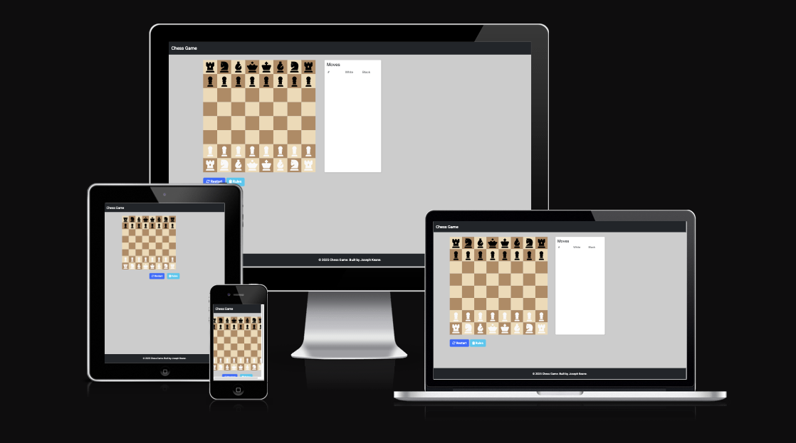

This is a local two-player chess game with basic rule enforcement to prevent most illegal moves. A built-in rules modal offers a quick overview of how each piece moves and the objective of the game.

### Current Limitations
- Castling is not yet supported  
- En passant is not implemented  

### Planned Features
- Full rule support  
- Computer opponents  
- A more interactive experience for new players with dots to show legal moves


Visit the deployed website [here](https://itjosephk2.github.io/chess-game/)

## Table of Contents

## Table of Contents

1. [Current Limitations](#current-limitations)  
2. [Planned Features](#planned-features)  
3. [User Experience (UX)](#user-experience-ux)  
   1. [Project Goals](#project-goals)  
   2. [User Requirements](#user-requirements)  
   3. [Color Scheme](#color-scheme)  
   4. [Typography](#typography)  
   5. [Wireframes](#wireframes)  
4. [Features](#features)  
   1. [General](#general)  
   2. [index.html](#indexhtml)  
   3. [Game Board](#game-board)  
   4. [Notation Board](#notation-board)  
5. [Technologies Used](#technologies-used)  
   1. [Languages Used](#languages-used)  
   2. [Frameworks, Libraries and Programs Used](#frameworks-libraries-and-programs-used)  
6. [Testing](#testing)  
   1. [Testing User Requirements](#testing-user-requirements)  
   2. [Known Bugs](#known-bugs)  
   3. [Code Validation](#code-validation)  
   4. [Tools Testing](#tools-testing)  
   5. [Browser Compatibility](#browser-compatibility)  
   6. [Device Compatibility](#device-compatibility)  
   7. [Common Elements Testing](#common-elements-testing)  
7. [Finished Product](#finished-product)  
8. [Deployment](#deployment)  
   1. [GitHub Pages](#github-pages)  
9. [Credits](#credits)  
   1. [Content](#content)  
   2. [Media](#media)  
   3. [Code](#code)  
10. [Acknowledgements](#acknowledgements)  

***

## User Experience (UX)

### Project Goals

* The website should allow users to move chess pieces and play a full game of chess.

* Ideally the rules and legal moves will be built into the game.

* Supply the user with a link to learn how to play the game.

* Allow the user to change the theme of the chessboard.

### User Requirements

* As a user, I want to be able to navigate the website intuitively and be able to play chess.

* As a user, I want to play chess locally with another person.

* As a user, I want to see the notation of my game on screen

* As a user, I want to be dissalowed from making illegal moves.


### Color Scheme
The colors used in this site are primarily based on the black and white of a chessboard.

### Typography

The main font used in the site is The site uses Roboto as the primary font, with Arial and sans-serif as fallbacks. 

### Wireframes

Wire frames were drawn by hand to form a rough structural shape of the site and then each section was designed with pen and paper and mocked up with html and css befor implementation.

[Back to top ⇧](#Chess-Game)

## Features

### General

* Chess game for playing with two people

### index.html

### Game Board
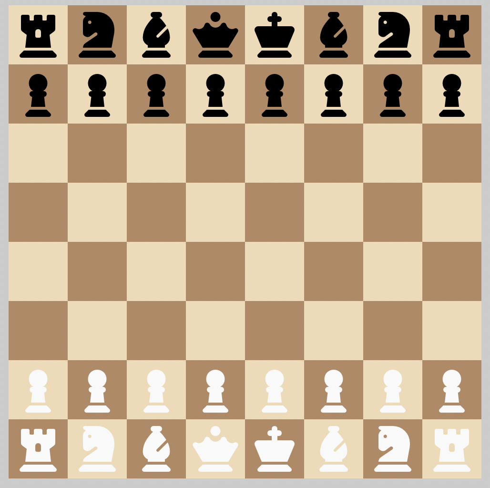

* chess Board

  - The chessboard allows players to move pieces using click events.
       

### Notation Board
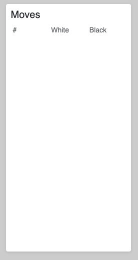

* Notation Board

  - This updates with the moves of the game in order they occur.

  - It dissapears on smaller viewports

### Chess Rules
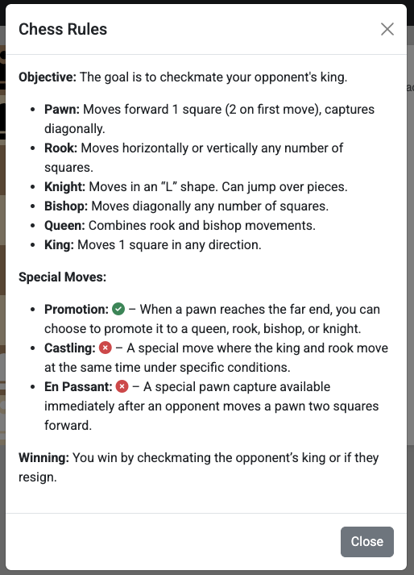

* Chess Rules  
  - Shows a list of all piece movements and special rules.  

  - Accessible modal with focus trapping and keyboard support.  

  - Green **Play** button starts the game and dismisses the modal.  

### Win Modal
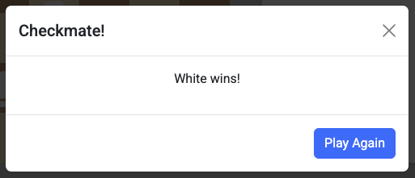

* Win Modal  
  - Shows “Checkmate!” title and dynamically inserts the winning side.  

  - Presents the winner’s message in the modal body (`<p id="modalMessage">`).  

  - Includes a **Play Again** button to reset the board and close the modal.  

### Stalemate Modal
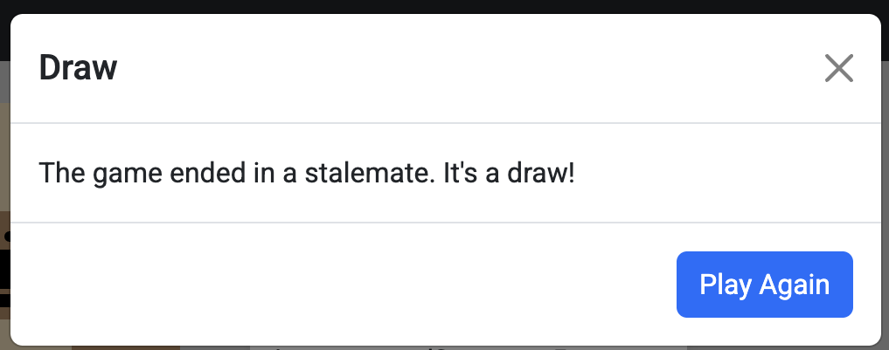

* Stalemate Modal  
  - Triggered when stalemate is detected.  

  - Displays “Draw” title to inform players of the stalemate.  

  - Offers a **Play Again** button to restart the game and close the modal.  

 
[Back to top ⇧](#Chess-Game)

## Technologies Used

### Languages Used
* [HTML5](https://en.wikipedia.org/wiki/HTML5)
* [CSS3](https://en.wikipedia.org/wiki/CSS)
* [JS](https://en.wikipedia.org/wiki/JavaScript)

### Frameworks, Libraries and Programs Used

* [Google Fonts](https://fonts.google.com/)
    - Google Fonts – For Roboto font

* [Font Awesome](https://fontawesome.com/)
     - Font Awesome was used throughout all pages to add icons in order to create a better visual experience for UX purposes.

* [GitHub](https://github.com/)
     - GitHub was used to store the project after pushing.

* [Am I Responsive?](http://ami.responsivedesign.is/#)
    - Am I Responsive was used in order to create the mockup image.

* [Firefox Dev edition](https://www.mozilla.org/en-US/firefox/developer/)
    - Firefox dev tools was used for everything. Checking the website as I developed it. Learning the exact implications of css properties and how it effected the layout and design of an element. Checking for responsivity throughout the design to ensure it worked on all sized devices.
 
* [Google Chrome Developer Tools](https://developer.chrome.com/docs/devtools/)
    - Google Developer tools was used for generating the lighthouse report and further reccomended documentation was utilised to increase the score.

* [W3C Markup Validator](https://validator.w3.org/)
    - W3C Markup Validator was used to validate the HTML code.

* [W3C CSS Validator](https://jigsaw.w3.org/css-validator/)
    - W3C CSS Validator was used to validate the CSS code.

[Back to top ⇧](#Chess-Game)


## Testing

### Testing User Requirements

* As a user, I want to be able to navigate the website intuitively and be able to play chess.
  
    - The website offers a intuitive structure for the user to start playing chess immediately.

* As a user, I want to be able to play chess localy with anothr person.

    - The website offers the ability to control both the white and black pieces allowing for two player game locally.

* As a user, I want to be dissalowed from making illegal moves.
    
    - Illegal moves are blocked, although en passant and castling are not yet implemented.

* As a user, I want to see the notation of my game on screen

    - If the viewport is large enough the user can see their game notation.


## Known Bugs

1. **Stalemate detection failure**  
   - Description: The game does not correctly identify a stalemate when the player’s king has no legal moves remaining and no other piece can be moved.  
   - Root Cause: In the `checkForStalemate` function, the code used a bare reference to `isKingInCheck` without invoking it with the current board state, causing the condition to always evaluate incorrectly.  
   - Fix: Updated the check to correctly call:  
     ```js
     if (isKingInCheck(playerColor, chessboard, squares)) {
       return false;
     }
     ```
     ensuring the function receives `playerColor`, `chessboard`, and `squares`.  
   - Location: `checkForStalemate` in `script.js`  

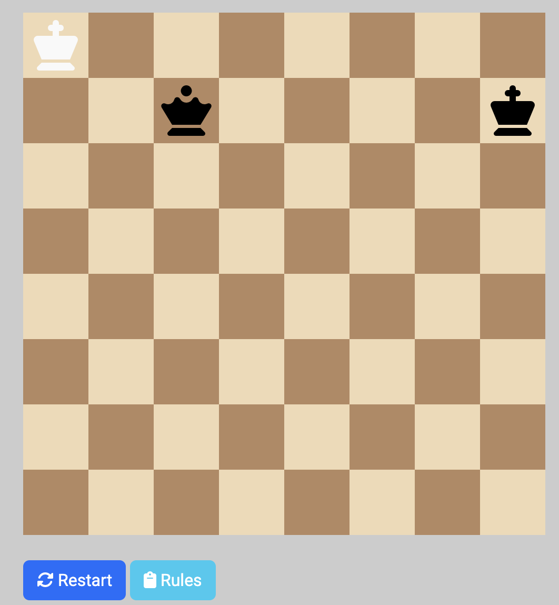

2. **False check on king capture of pawn with two-square move possibility**  
   - Description: The king was incorrectly flagged as in check when capturing a pawn that could move two squares on its first move.  
   - Root Cause: Because `isKingInCheck` wasn’t called with parameters, any capture scenario always fell back to the incorrect default check-​evaluation.  
   - Fix: The same invocation correction of `isKingInCheck(playerColor, chessboard, squares)` also resolved this bug, allowing accurate post-capture check detection. I honestly have no Idea why this is. 
   - Location: `checkForStalemate` in `script.js`  

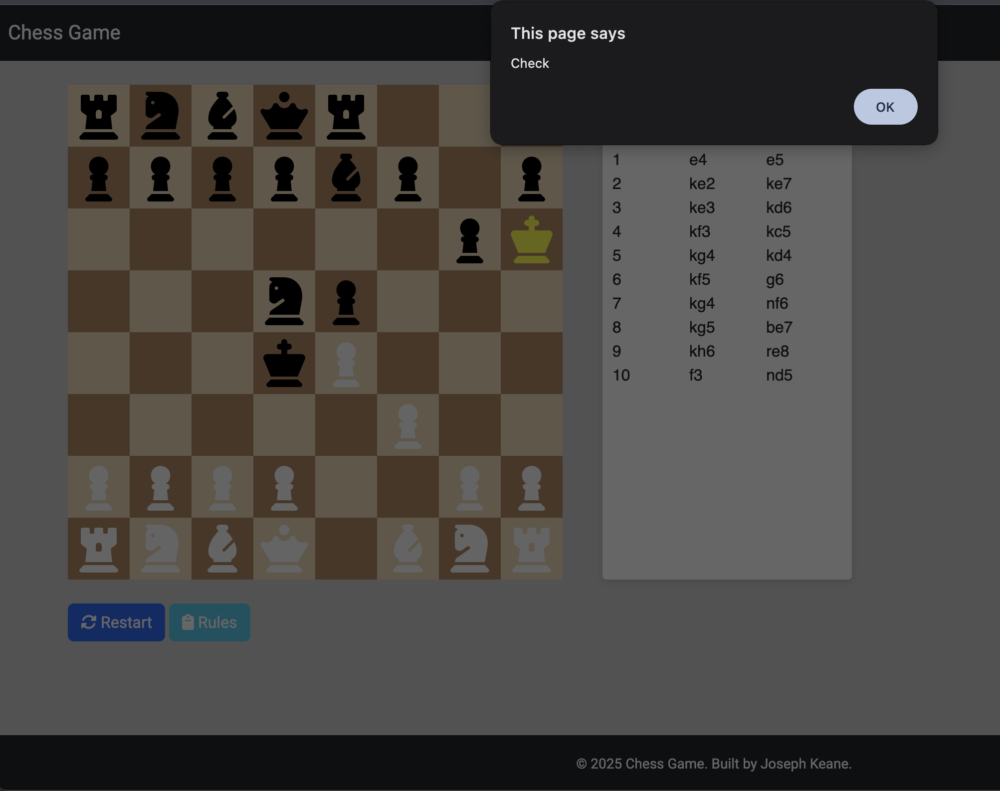


### Code Validation

* The [W3C Markup Validator](https://validator.w3.org/) and [W3C CSS Validator](https://jigsaw.w3.org/css-validator/) and [JSHint](https://jshint.com/) services were used to validate all pages of the project in order to ensure there were no syntax errors.

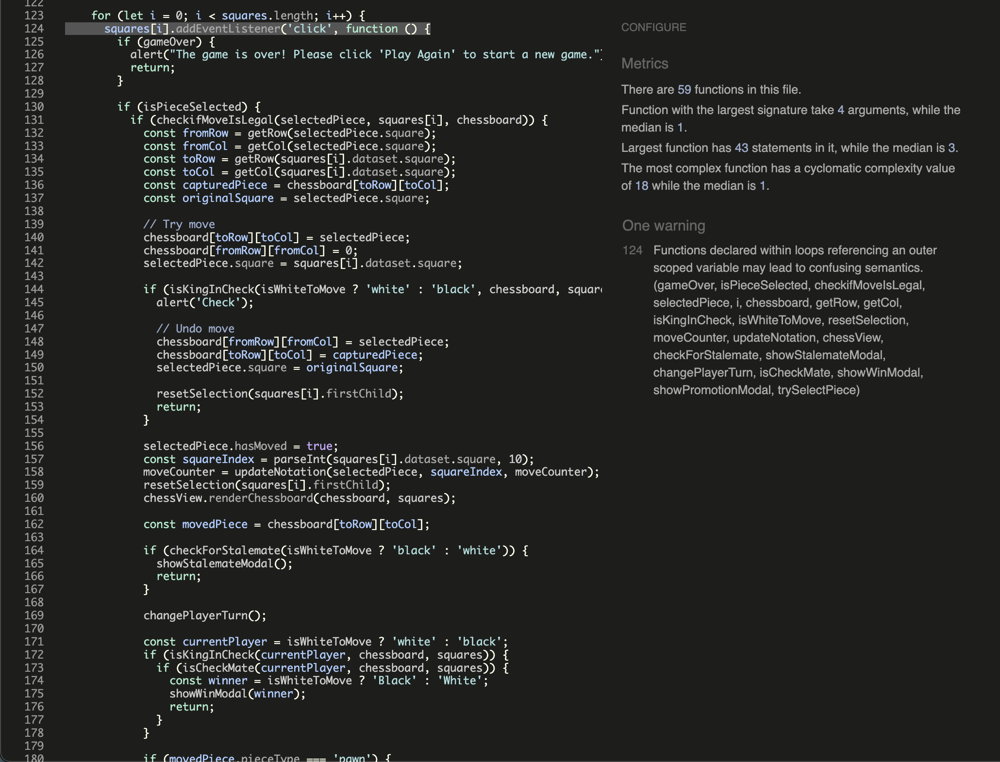
* These closures are intentionally defined within loops to associate each board square with its specific event handler, safely capturing the loop index and current game state.  
* Extensive playtesting has verified that this approach works reliably without causing unexpected behavior, mitigating the theoretical lint concern.

### Tools Testing

* [Firefox Developer Edition](https://www.mozilla.org/en-US/firefox/developer/)

    - Firefox dev tools was used during the development process to test, explore and modify HTML elements and CSS styles used in the project.

* Responsiveness

    - [Firefox Developer Edition](https://www.mozilla.org/en-US/firefox/developer/) was used to check responsivity throughout the project.
 
* Accesibility
    - [Google Chrome Developer Tools](https://developer.chrome.com/docs/devtools/) was used for generating the lighthouse report and further reccomended documentation was utilised to increase the score.


### Browser Compatibility


* Goolgle Chrome

    - No appearance, responsiveness nor functionality issues.

* Safari

    - No appearance, responsiveness nor functionality issues.

* Mozilla Firefox

    - No responsiveness nor functionality issues.

* Microsoft Edge

    - Footer titles were white on a white background and thus invisible. Not a microsoft edge issue due to a general h2 test I did else where.

### Device compatibility

* MacBook Pro 13.3"

    No appearance, responsiveness nor functionality issues.

* Dell P2417Hc 24″ Monitor

    No appearance, responsiveness nor functionality issues.

* Xiaomi Redmi 9

    Audio element is too small. Will create my own with javascript in the future.

* Samsung A3

    Audio element is too small. Will create my own with javascript in the future.

* Samsung A54

    Audio element is too small. Will create my own with javascript in the future.

* Steam Deck

    No appearance, responsiveness nor functionality issues.

* Imac

    No appearance, responsiveness nor functionality issues.


### Common Elements Testing

* Index Page
          
    * Chess Board

        - Allows the user to move chess pieces
        - Highlights the appropriate piece.
        - deselects a piece if move is illegal allowing users to change the piece they wanted to move withought clicking off the screen.
        - Pieces have restricted movement to their move set.
        - Unfortunately due to time constraints, I was unable to implement castling and en passant.
     
    * Notation Board

        - Displays the move made on the screen in the order it happens
  
          

[Back to top ⇧](#Chess-Game)


## Finished Product

When the page loads, the Rules modal appears by default; clicking the green **Play** button starts the game. Players then take turns selecting and moving their pieces on the board. The objective is to checkmate your opponent’s king by placing it under attack so that it has no legal moves to escape.

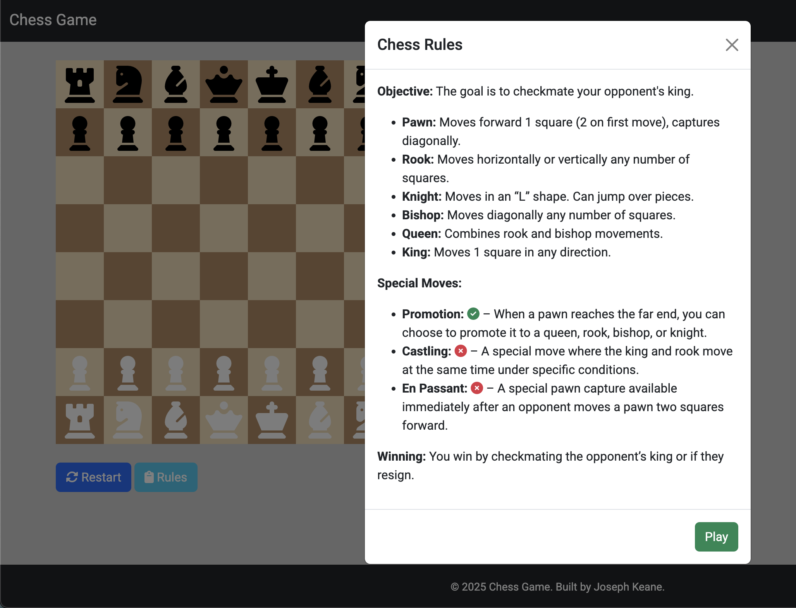
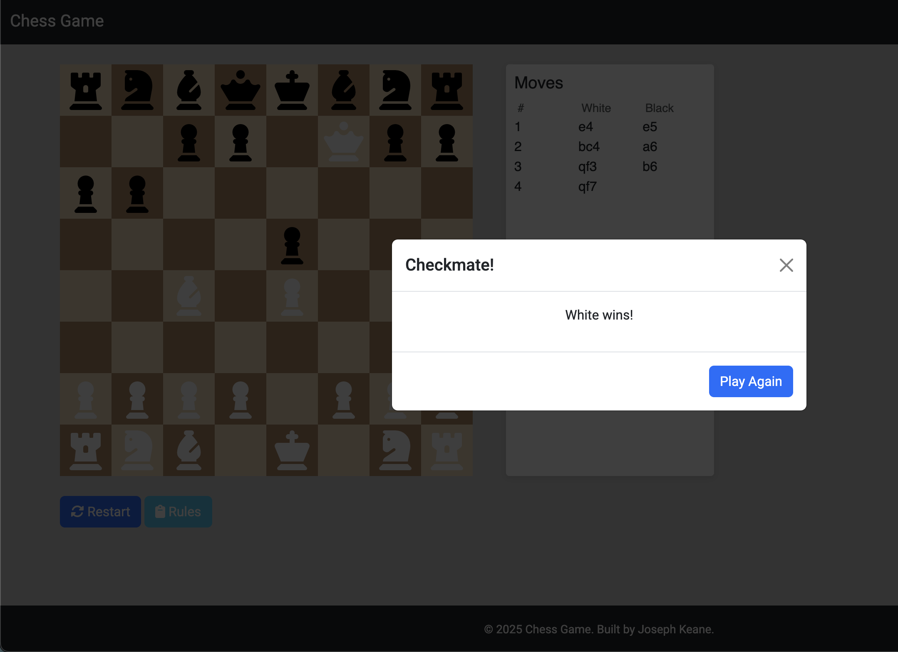


[Back to top ⇧](#Chess-Game)


## Deployment

* This website was developed using VSCODE and then pushed to github. Deployed using github pages.

### GitHub Pages

* Here are the steps to deploy this website to GitHub Pages from its GitHub repository:

    1. Log in to GitHub and locate the [GitHub Repository](https://github.com/).

    2. At the top of the Repository, locate the Settings button on the menu.

    3. Scroll down the Settings page until you locate the Pages section.

    4. Under Source, click the dropdown called None and select Master Branch.

    5. The page will refresh automatically and generate a link to your website. 

[Back to top ⇧](#Chess-Game)


## Credits

### Content

- The game rules summary was written based on standard chess movement rules, cross-checked with resources like [Wikipedia - Rules of Chess](https://en.wikipedia.org/wiki/Rules_of_chess) and [Chess.com](https://www.chess.com/learn-how-to-play-chess).
- Descriptions and guidance text throughout the site were written by me with clarity and accessibility in mind.

### Media

- All wireframes and mockups were created by me using hand-drawn designs and browser tools.
- Screenshots used in the README were captured from the live deployed site using developer tools.

### Code

- Code was written by me, with regular consultation of the following resources for guidance and solutions:
  - [YouTube](https://youtube.com/) – tutorials and chess logic examples.
  - [W3Schools](https://www.w3schools.com/) – syntax references and CSS layout help.
  - [Stack Overflow](https://stackoverflow.com/) – for debugging help and JavaScript logic clarification.
  - [MDN Web Docs](https://developer.mozilla.org/en-US/) – for JavaScript behavior and DOM manipulation explanations.


### Code

* [Youtube](https://youtube.com/) and [W3Schools](https://www.w3schools.com/) were consulted on a regular basis for inspiration and sometimes to be able to better understand the code being implement.

[Back to top ⇧](#Chess-Game)


## Acknowledgements

* Marcel, my mentor, for his constant encouragement and practical guidance and invaluable support and guidance. Truly would not have done it without him.

* My friends, for their valuable opinions and and critic during the design and development process.

* Code Institute and its amazing Slack community for their support and providing me with the necessary knowledge to complete this project.

[Back to top ⇧](#Chess-Game)
